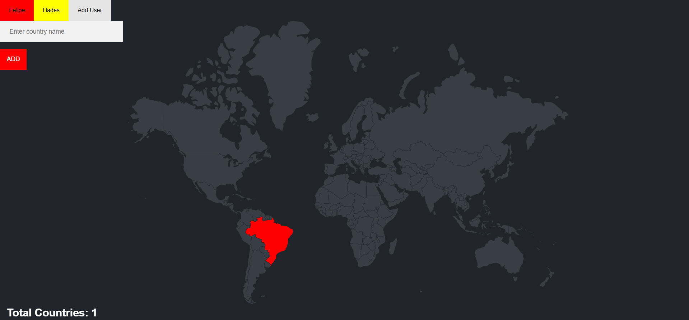

# Travel Tracker  

  

Travel Tracker é uma aplicação web que permite que diferentes usuários registrem os países que visitaram. Cada usuário possui uma lista exclusiva de países visitados, que são armazenados em um banco de dados PostgreSQL. O sistema impede a adição de países duplicados para o mesmo usuário e destaca os países registrados em um mapa interativo.  

## Tecnologias Utilizadas  

- **Node.js** com **Express.js** para o backend  
- **PostgreSQL** para armazenamento dos dados  
- **EJS** para renderização do frontend  
- **Body-parser** para processamento de requisições HTTP  
- **HTML, CSS e JavaScript** para a interface do usuário  

## Funcionalidades  

- Criar e gerenciar múltiplos usuários  
- Cada usuário tem sua própria lista de países visitados  
- Adicionar países visitados através de um formulário  
- Garantir que um mesmo país não seja adicionado mais de uma vez por usuário  
- Destacar no mapa os países registrados para cada usuário  
- Exibir o número total de países visitados pelo usuário atual  

## Como Executar o Projeto  

### Pré-requisitos  
- Node.js instalado  
- PostgreSQL configurado com um banco de dados chamado `world`  

### Configuração do Banco de Dados  

1. Criar o banco de dados `world` no PostgreSQL:  

   ```sql
   CREATE DATABASE world;
   ```
2. Criar as tabelas necessárias:

   ```sql
   CREATE TABLE countries (
    id SERIAL PRIMARY KEY,
    country_code CHAR(2) NOT NULL,
    country_name VARCHAR(100) NOT NULL
   );

   CREATE TABLE users (
      id SERIAL PRIMARY KEY,
      name VARCHAR(100) NOT NULL,
      color VARCHAR(7) NOT NULL
   );

   CREATE TABLE visited_countries (
      id SERIAL PRIMARY KEY,
      country_code CHAR(2) NOT NULL,
      user_id INTEGER REFERENCES users(id) ON DELETE CASCADE,
      UNIQUE (country_code, user_id) -- Garante que o mesmo país não seja adicionado duas vezes para o mesmo usuário
   );

   ```

3. Popular a tabela countries utilizando os arquivos CSV localizados na pasta csv-files:
 
   ```sql
   COPY countries(country_code, country_name)
   FROM 'caminho/para/csv-files/countries.csv' DELIMITER ',' CSV HEADER;
   ```

## Instalação e Execução
1. Clonar o repositório:
   ```bash
   git clone https://github.com/Kiy0p0N/travel-tracker.git
   cd travel-tracker/code
   ```
2. Instalar as dependências:
   ```bash
   npm install
   ```

3. Iniciar o servidor:
   ```bash
   npm start
   ```

4. Acessar a aplicação no navegador:
   ```
   http://localhost:3000
   ```
## Exemplo de Uso
1. Criar um novo usuário ou selecionar um existente.
2. Digitar o nome de um país no campo de entrada.
3. Clicar no botão "Add".
4. O país será armazenado no banco de dados e destacado no mapa para o usuário atual.
5. O contador será atualizado para refletir o número total de países visitados.
6. Se um país já foi registrado pelo usuário, uma mensagem de erro será exibida.